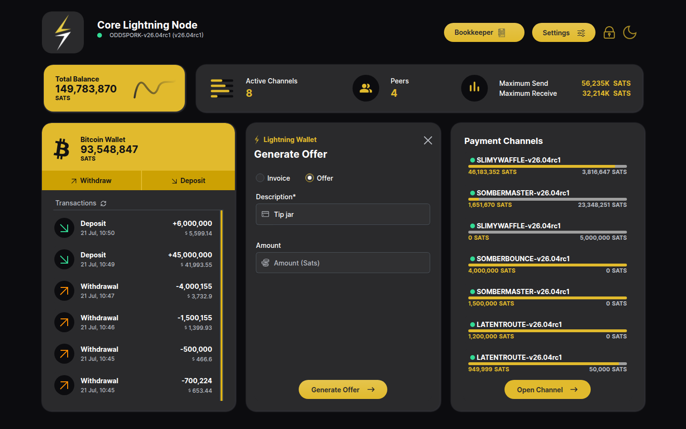
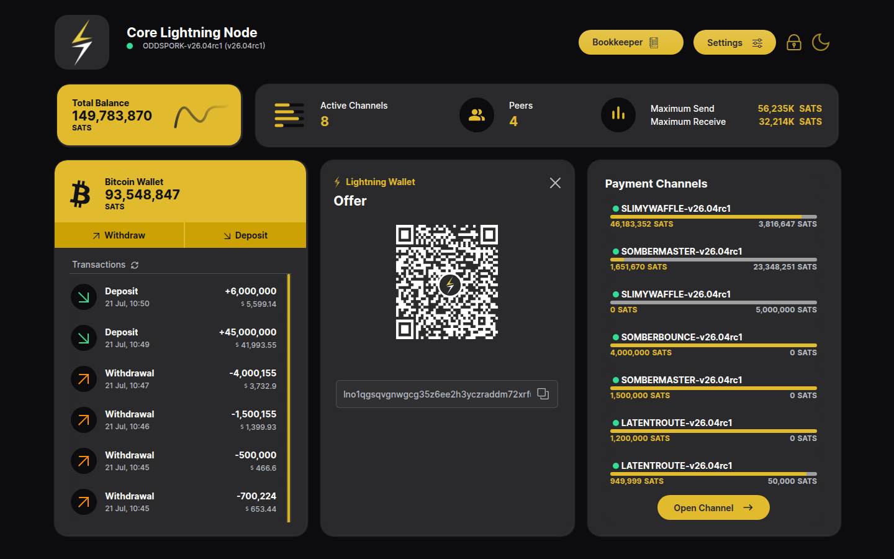
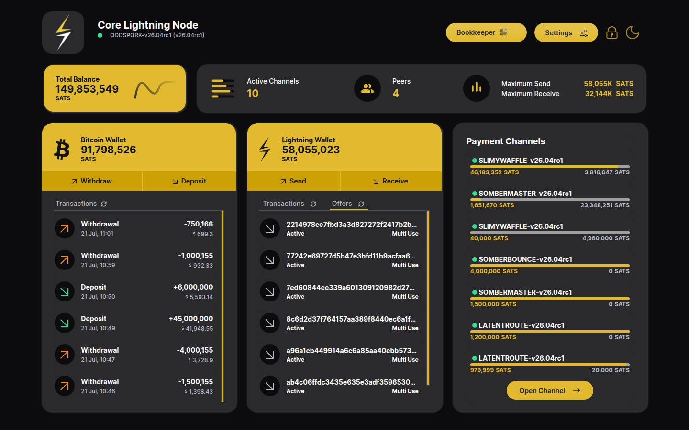

# BOLT12 Offers

A BOLT12 **offer** is a *reusable* payment code: unlike a BOLT11 invoice it
does not expire after one payment — any number of payers can pay it, any
number of times, each payment fetching its own fresh invoice from your node.

## Create an offer

1. Click **Receive** on the Lightning Wallet card.
2. Switch the payment type radio from **Invoice** to **Offer**.
3. Enter a **Description**. Leave **Amount** empty for an *any-amount* offer
   (the payer chooses what to pay — ideal for tips/donations), or set a fixed
   amount:

   

4. Click **Generate Offer**. The app calls the node's `offer` RPC and shows
   the `lno1…` offer string as a QR code. This QR can be printed or published
   permanently — it never becomes stale:

   

## The same offer, paid more than once

Each payer scans the same offer, their wallet runs `fetchinvoice` against it,
and pays the returned invoice. Here the offer above was paid **twice by two
different nodes** — 15,000 sats and 20,000 sats — and both payments appear as
separate entries with the offer's description:

## The Offers tab

The **Offers** tab of the Lightning Wallet card lists every offer created on
the node with its status — *Active* and *Multi Use* below. This is where you
can find or disable an offer later:

