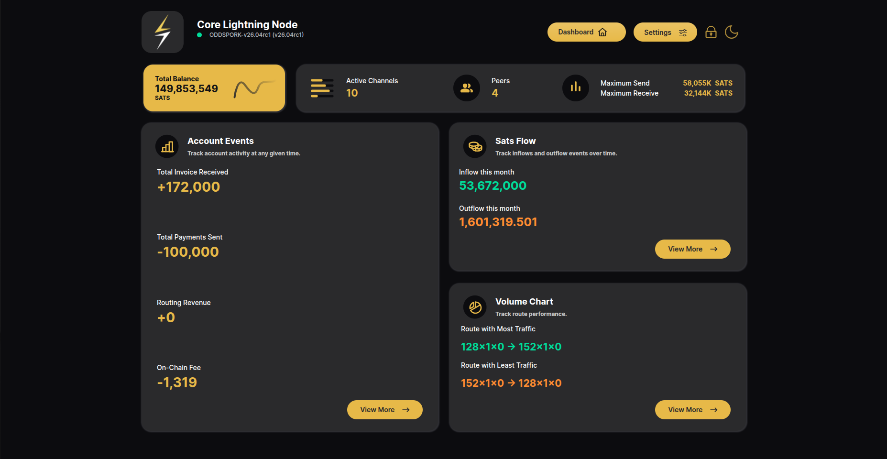
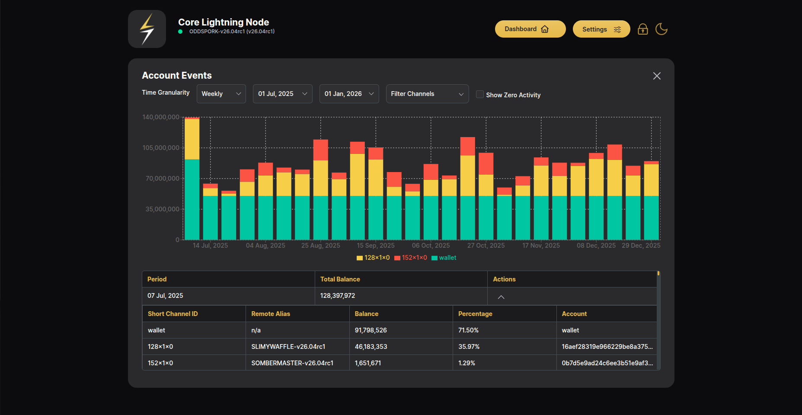
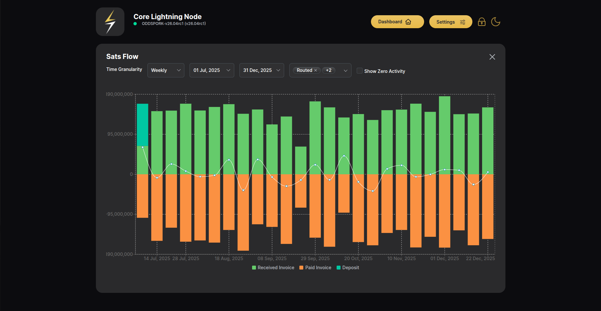
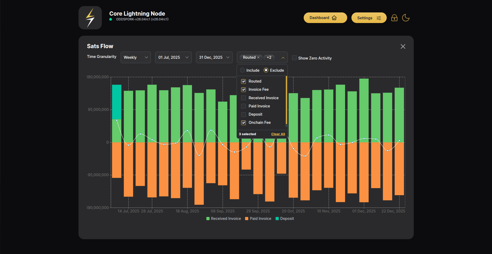
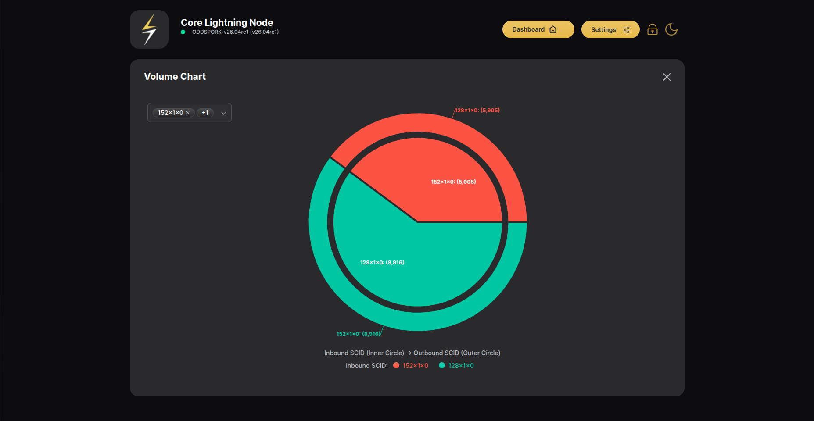

# Bookkeeper

Bookkeeper is the accounting side of the application, built on Core
Lightning's `bookkeeper` plugin. Open it with the **Bookkeeper** button in
the header (the button turns into **Dashboard** to switch back).

## Bookkeeper dashboard

The landing page summarizes the node's accounting in three cards, each with
a **View More** that opens the full feature:

- **Account Events** — track account activity at any given time: total
  invoices received, total payments sent, routing revenue and on-chain fees.
- **Sats Flow** — inflow and outflow this month.
- **Volume Chart** — route performance: the routes with the most and least
  forwarded traffic.

## Account Events

Balances of every account — the on-chain **wallet** plus each channel
(by short channel id) — stacked over time:

- Filter by **Time Granularity** (daily/weekly/monthly), a **date range**,
  and specific **channels**; **Show Zero Activity** includes empty periods.
- The chart stacks each account's balance per period, color-coded per
  account.
- The table below breaks a selected period down: short channel id, remote
  alias, balance, percentage of the total, and the underlying account id.

## Sats Flow

Money movement over time — inflows drawn upward, outflows downward, with a
net-flow line across the bars:

- The same granularity/date-range controls apply, plus an **event-type
  filter**. Event types include Routed, Invoice Fee, Received Invoice,
  Paid Invoice, Deposit and Onchain Fee, and the filter can either
  **Include** or **Exclude** the selected set:

  

## Volume Chart

Where routed traffic actually flows: a two-ring chart pairing the
**inbound channel (inner circle)** with the **outbound channel (outer
circle)** for forwarded payments, so you can see which route pairs carry
the volume. Channels can be filtered with the dropdown:

