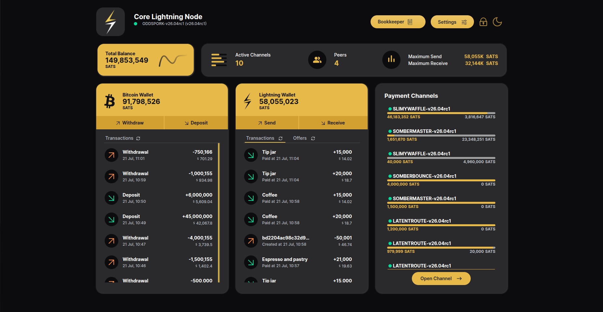

# The CLN Dashboard

The home page of the application is a single dashboard that surfaces the
node's full state at a glance:

## Header

- **Node identity** — the node's alias, version and connection status
  (green dot = connected).
- **Bookkeeper** — opens the [Bookkeeper dashboard](Bookkeeper.md) with
  accounting and routing analytics.
- **Settings** — units (SATS/BTC), fiat currency, light/dark theme and
  password configuration.
- The lock icon logs out of the session; the moon/sun icon toggles the theme
  directly.

## Balance and node summary

- **Total Balance** — combined on-chain + Lightning funds.
- The summary strip beside it shows **Active Channels**, connected **Peers**,
  and **Maximum Send / Maximum Receive** — the node's total outbound and
  inbound Lightning capacity.

## Bitcoin Wallet card

On-chain funds. **Withdraw** sends to a bitcoin address, **Deposit**
generates a receive address, and the list below shows on-chain transactions
(deposits and withdrawals) with their fiat value.

## Lightning Wallet card

Off-chain funds. **Send** pays a BOLT11 invoice, BOLT12 offer or keysend;
**Receive** generates invoices and offers. Two tabs list the node's
**Transactions** (paid/received payments) and **Offers**. Step-by-step
guides: [Send & Receive Payments](Send-Receive.md) and
[BOLT12 Offers](BOLT12-Offers.md).

## Payment Channels card

Every channel with its state dot (green = active, yellow = pending,
red = inactive), peer alias and a liquidity bar (yellow = local /
spendable, grey = remote / receivable). Clicking a channel opens its
detail view; **Open Channel** starts a new one — see
[Opening a Channel](Open-Channel.md).

## Step-by-step guides

Detailed walkthroughs, with screenshots, for the flows available from this
dashboard:

| Guide | What it covers |
|---|---|
| [Send & Receive](Send-Receive.md) | Receiving via BOLT11 invoice + QR, and paying a pasted invoice |
| [BOLT12 Offers](BOLT12-Offers.md) | Creating a reusable offer, its QR, and the same offer paid more than once |
| [Opening a Channel](Open-Channel.md) | Peer + amount → pending → active, and reading a channel's liquidity |
