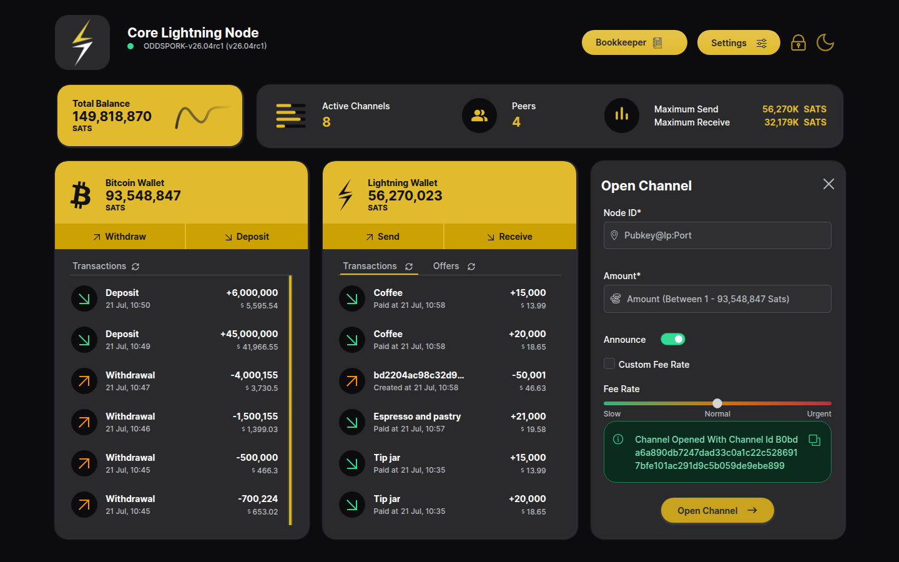
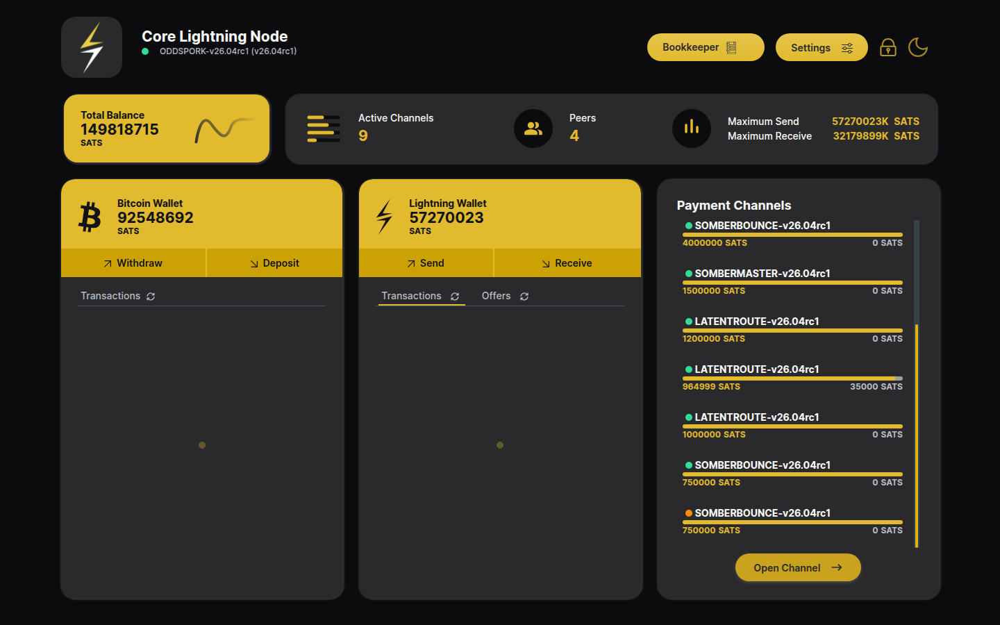
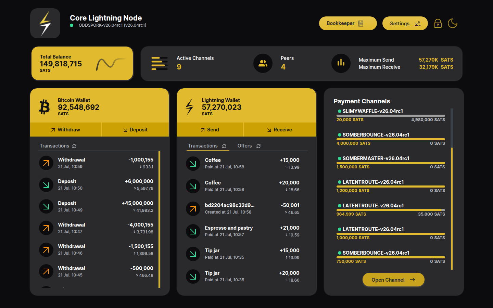
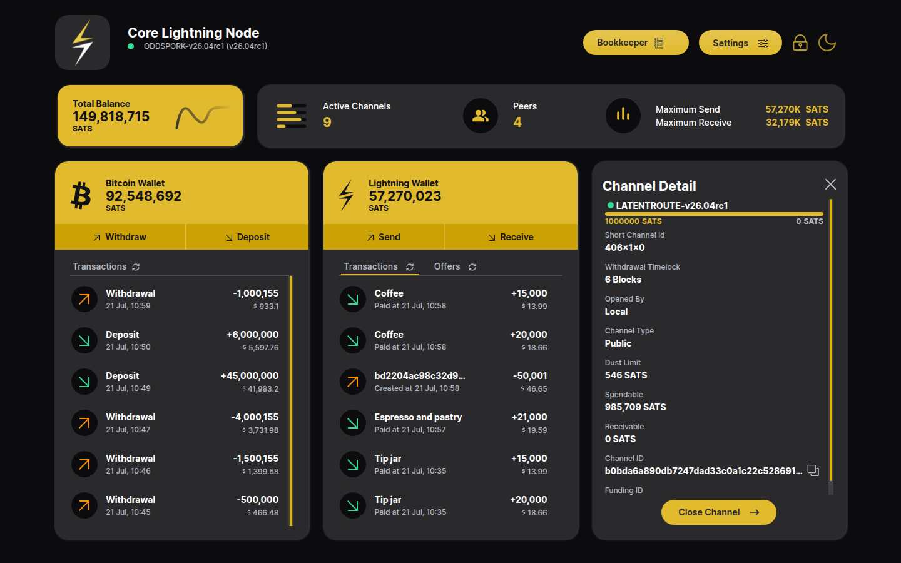

# Opening a Payment Channel

Channels are managed from the **Payment Channels** card on the home page.

## Open a channel

1. Click **Open Channel** at the bottom of the Payment Channels card.
2. Fill in:
   - **Node ID** — the peer in `pubkey@ip:port` form.
   - **Amount** — the channel capacity in sats, funded from the on-chain
     (Bitcoin) wallet. The valid range is shown in the placeholder.
   - **Announce** — leave on for a public channel, off for a private one.
   - **Fee Rate** — Slow / Normal / Urgent, or tick *Custom Fee Rate* to
     enter an exact perkw rate.

   

3. Click **Open Channel**. The app connects to the peer, funds the channel
   and broadcasts the funding transaction; a green alert shows the new
   channel id:

   

## Pending → Active

Until the funding transaction confirms, the channel sits in the list with a
**yellow dot** (state `CHANNELD_AWAITING_LOCKIN`) — it cannot route payments
yet:

After enough confirmations (6 blocks here) the dot turns **green** and the
channel is active and ready to route:

## Reading a channel's liquidity

Every list entry shows a liquidity bar: the **yellow** portion is the local
balance (what you can send through this channel) and the **grey** portion is
the remote balance (what you can receive). A freshly opened channel is all
local balance — you funded the whole capacity — so you can send but not yet
receive through it.

Clicking a channel opens **Channel Detail** with the full picture: the
liquidity bar, short channel id, who opened it, channel type, dust limit,
**Spendable** / **Receivable** amounts and the channel/funding ids. The
channel can also be closed from here:

