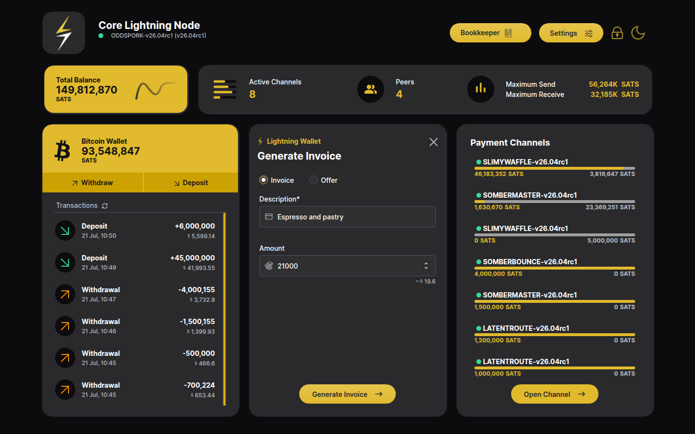
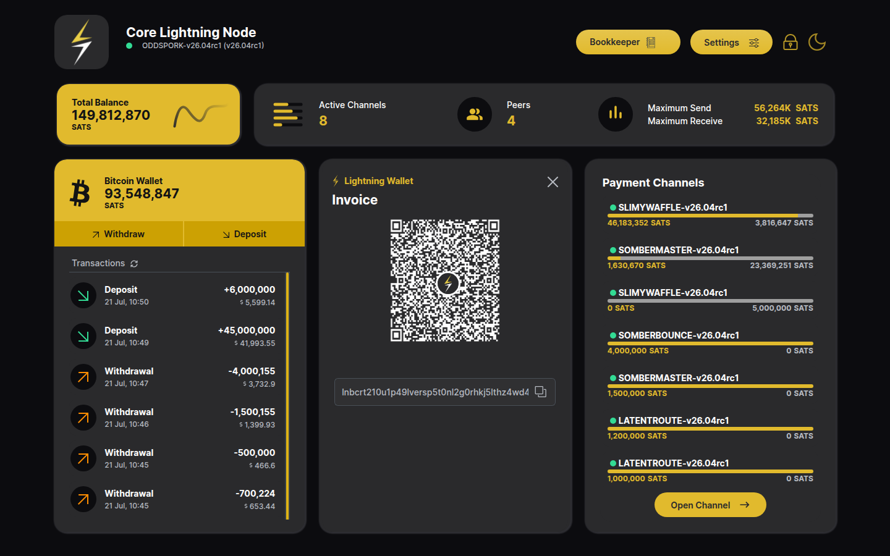
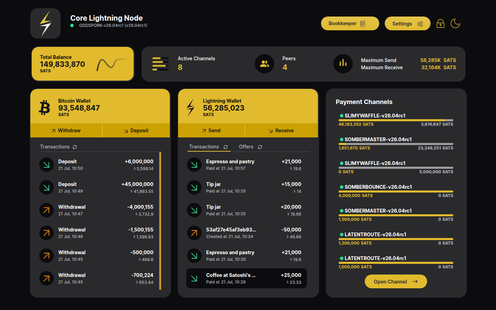
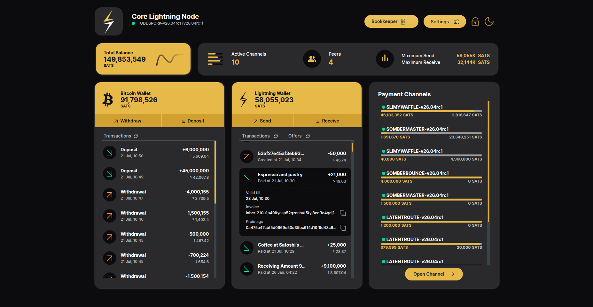
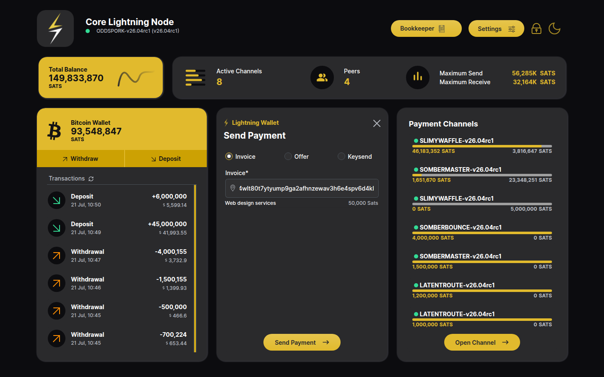
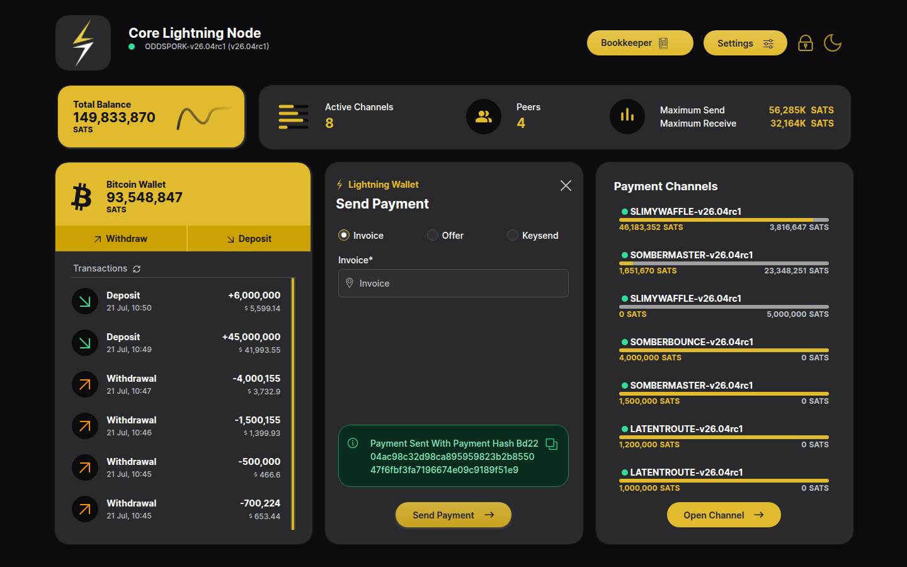
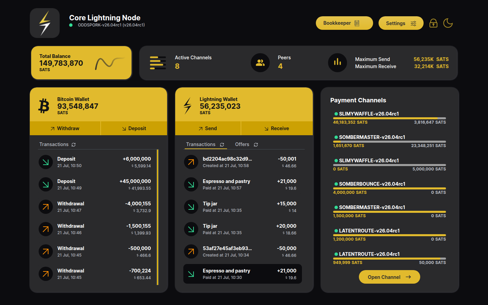

# Send & Receive Payments

The **Lightning Wallet** card on the home page is the entry point for both
flows.

## Receive — create an invoice

1. Click **Receive** on the Lightning Wallet card.
2. Keep the payment type on **Invoice** (the default; **Offer** creates a
   reusable BOLT12 offer instead — see [BOLT12 Offers](BOLT12-Offers.md)).
3. Enter a **Description** (required) and an **Amount** in sats. Leaving the
   amount empty creates an *open* (any-amount) invoice. The fiat equivalent is
   previewed under the amount field.

   

4. Click **Generate Invoice**. The app calls the node's `invoice` RPC and
   shows the BOLT11 string as a QR code, ready to be scanned by the payer.
   Clicking the QR or the copy icon copies the invoice.

   

5. Once the payer settles the invoice, it appears at the top of the
   **Transactions** list with its description, the received amount and the
   *Paid at* timestamp:

   

6. Clicking the entry expands its details (payment hash, preimage, etc.):

   

## Send — pay an invoice

1. Click **Send** on the Lightning Wallet card.
2. Keep the payment type on **Invoice** (**Offer** pays a BOLT12 offer,
   **Keysend** pays a node pubkey directly without an invoice).
3. Paste (or scan) the BOLT11 invoice into the **Invoice** field. The app
   decodes it immediately and shows the invoice's description and amount
   underneath the field, so you can verify what you are about to pay —
   this is the confirmation step:

   

   *For an open (any-amount) invoice an extra Amount field appears so you
   choose how much to send.*

4. Click **Send Payment**. On success the app shows a green alert with the
   payment hash:

   

5. The outgoing payment shows up in the **Transactions** list with a
   *Created at* timestamp and a negative amount:

   
